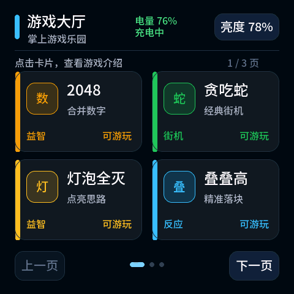

# 掌上游戏乐园 · ESP32-C6 Pocket Arcade

把一块 2.16 英寸触摸开发板，变成随手可玩的中文掌上游戏机。

本项目基于微雪 **ESP32-C6-Touch-AMOLED-2.16**，使用 **ESP-IDF 5.5.3 + LVGL 9.5.0** 开发。围绕小屏幕设计触摸操作，并结合实体按键和六轴传感器，提供九款小游戏、中文游戏大厅、电量显示和亮度调节。



> 图片为实际 LVGL 界面的主机渲染图，并非设备实拍；图中电量为测试输入。

## 九款游戏

| 游戏 | 玩法与操作 |
| --- | --- |
| 2048 | 四向滑动合并数字，支持撤销一步；自动保存当前棋盘和最高分 |
| 贪吃蛇 | 全屏滑动转向，较慢初始速度与较粗蛇身，适合小屏操作 |
| 灯泡全灭 | 点击切换灯泡状态，寻找将全部灯泡熄灭的解法 |
| 叠叠高 | 把握时机落下移动方块，挑战堆叠高度 |
| 打砖块 | 点击发球、拖动挡板，击碎24块砖，拥有3次生命 |
| 记忆翻牌 | 16张卡片、8组数字，配对并记录步数 |
| 扫雷 | 6×6棋盘、6颗雷，支持开格和插旗；首次开格及周围安全 |
| 反应挑战 | 等待提示后点击，记录5次有效反应的平均成绩 |
| 重力滚球 | 倾斜开发板控制小球，穿过三关逐渐收窄的迷宫 |

## 为这块小屏幕设计

- **中文大厅**：每页四个条目，点击卡片查看介绍、启动游戏。
- **实体翻页**：BOOT/GPIO9上一页，KEY/GPIO10下一页；短按触发，带消抖，长按不连翻，中间PWR继续负责电源。
- **触摸控制**：滑动、点击和拖动适配480×480界面；详情、游戏和亮度弹窗中不响应大厅翻页键。
- **姿态控制**：QMI8658的加速度和角速度共同参与重力滚球控制；提供平放、向右、向下三步方向校准。
- **电量状态**：读取AXP2101电量估计，每10秒刷新，显示充电、USB或电池供电状态，低电量使用黄色提示。
- **亮度调节**：20%–100%可调；重启恢复默认78%。
- **断电续玩**：2048通过NVS保存进度与最高分，包含版本和CRC校验；其他游戏目前不保存断电进度。

## 硬件与软件

| 项目 | 配置 |
| --- | --- |
| 目标开发板 | Waveshare ESP32-C6-Touch-AMOLED-2.16 |
| 显示 | 480×480 AMOLED，CO5300，QSPI |
| 触摸 | CST9220，I²C |
| 运动传感器 | QMI8658，三轴加速度与三轴陀螺仪 |
| 电源管理 | AXP2101 |
| 开发框架 | ESP-IDF 5.5.3，C/C++ |
| 图形库 | LVGL 9.5.0，64 KiB内存池 |
| 中文字体 | Noto Sans SC子集，16/20/24/28 px |

驱动沿用官方适配方案，组件名称 `esp_lcd_sh8601` 和 `esp_lcd_touch_cst9217` 与板载实际芯片名称不同。项目面向上述C6型号，不能直接烧录到其他ESP32或显示屏型号。

## 快速开始

已有开发板可以使用仓库中的预编译固件，具体步骤见 [烧录说明](firmware/FLASH.md)。在ESP-IDF 5.5.3环境中从源码构建：

```sh
idf.py set-target esp32c6
idf.py build
idf.py -p COMx flash
```

将`COMx`换成实际串口。更新现有设备并保留2048存档时，优先只写应用分区；不要使用会覆盖NVS的合并镜像。具体命令及分区地址见烧录说明。

## 项目结构

```text
main/          中文大厅、各游戏规则与界面、姿态融合、中文字体
components/    显示、触摸、I²C、电源等板级适配
firmware/      预编译固件、校验值、启动日志和烧录说明
tests/host/    游戏规则测试及真实LVGL主机交互测试
tools/         中文字体生成工具
```

游戏规则与界面分离，主机测试可在没有开发板的情况下验证主要状态与交互。新增游戏可通过大厅注册表接入。

## 验证情况与当前范围

已完成ESP-IDF编译、应用分区烧录及启动检查；测试覆盖游戏规则、触摸交互、传感器异常、实体翻页和多次进入退出。中文显示、触摸与实体翻页已得到用户实机确认。详细记录见 [ACCEPTANCE.md](ACCEPTANCE.md)。

主机模拟测试不等同于全部硬件场景验证。目前未提供联网排行榜、OTA更新或全部游戏断电存档；电量是芯片估计值，未做完整续航标定。重力滚球手感与游戏难度仍可继续调整。

## 更多资料

- [构建、测试与字体维护](README.md)
- [第三方组件及字体授权说明](THIRD_PARTY_NOTICES.md)
- [微雪官方开发板文档](https://docs.waveshare.net/ESP32-C6-Touch-AMOLED-2.16/)

本项目包含第三方代码与字体，其授权分别以原文件和第三方说明为准。
